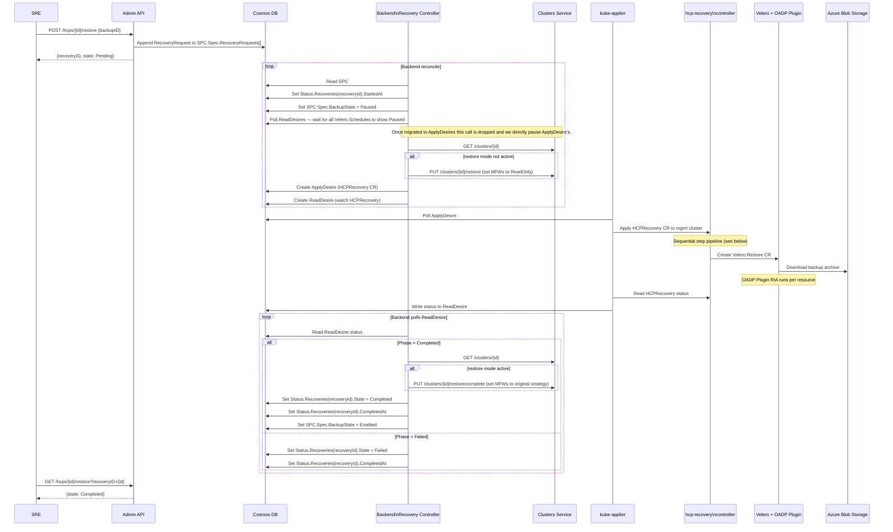
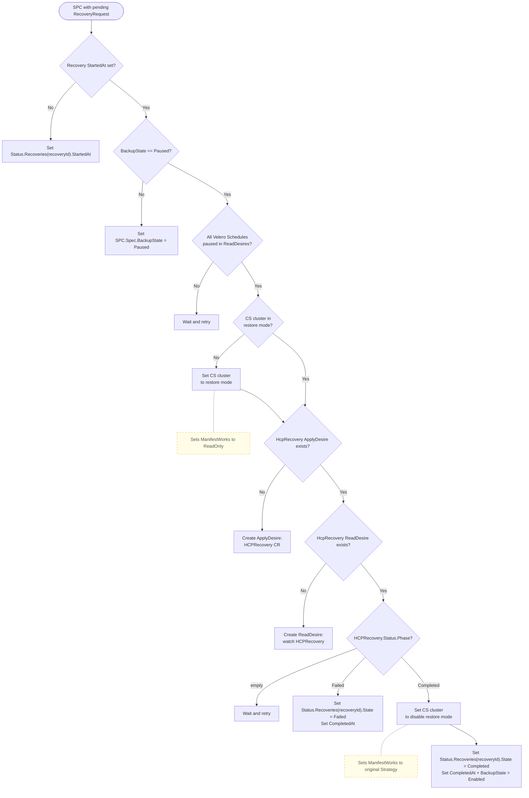
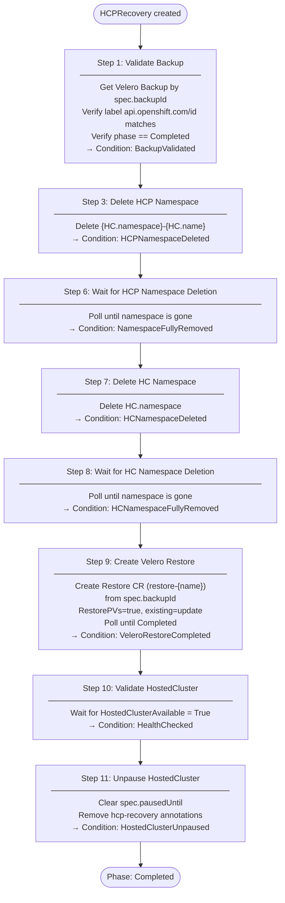

# ARO-HCP Hosted Cluster Recovery Flow

This document describes the end-to-end backup and recovery flow for a Hosted Control Plane (HCP) in ARO-HCP,
covering every component from the Admin API through the management cluster.

From a high level hosted control planes and node pools are completely torn down and restored from a backup.  Since ARO-HCP
is using CSI snapshots by nature this process does not clear informer caches or kubelet caches that exist in hosted control
plane or node pools.  etcd revisions are rolled back and controllers essentially ignore what happened.  This can cause mismatch
between etcd, kubelet, and CRI-O containers which causes cluster operators to be stuck (and any other customer components).
Due to this the recovery process deletes the hosted control plane to clear control plane caches, however the data plane
must also be be torn down which is not desirable but necessary.

There are 3 known solutions to leave the data plane online during etcd recovery, two are not viable to be automated so they are disregarded.

- Delete node pool and recreate on restore.
- Restart kubelet on all nodes.  Doesn't solve the problem of other controller caches.
- Add a noop config map to nodepool.spec.config to recreate nodes. This gets stuck draining / cordoning nodes due to the etcd/kubelet/CRI-O mismatch.

In the future ARO-HCP will move to etcdctl snapshots which has flags that bump object revision and compacts old objects
which effectively clear caches on informers and kubelets as described in https://etcd.io/docs/v3.5/op-guide/recovery/
etcdctl restore is not available until ocp 4.22 and ARO-HCP is required to support backups for 4.20 & 4.21.

## System Overview

ARO-HCP recovery spans four deployment planes:

| Plane | Components                                                        |
|-------|-------------------------------------------------------------------|
| **Service Cluster** | Admin API (`admin/server`), Backend controllers, Clusters Service |
| **Cosmos DB** | `ServiceProviderCluster` (SPC), `ApplyDesire`, `ReadDesire`       |
| **Management Cluster** | kube-applier, hcp-recovery controller, Velero + OADP plugin       |
| **Azure Blob Storage** | Velero backup archives, etcd snapshots                            |


## Restore Flow

### Overview



---

## Admin API Layer

**Files:** `admin/server/handlers/hcp/restore.go`, `admin/server/handlers/hcp/backups.go`

**POST /restore** (`PostRestore`):
1. Decodes `{backupID}` from the request body.
2. Checks no recovery is already in progress on the SPC (returns `409 Conflict` if so).
3. Generates a new `recoveryID` (UUID) and appends a `RecoveryRequest` to `SPC.Spec.RecoveryRequests`.
4. Replaces the SPC document in Cosmos.
5. Returns `{recoveryID, state: Pending}`.

**GET /restore** (`GetRestoreStatus`):
- Reads the SPC from Cosmos and looks up the `RecoveryStatus` matching the requested `recoveryID`.
- Returns `{state, startedAt, completedAt, backupID}`.

---

## Backend Recovery Controller

**File:** `backend/pkg/controllers/recoverycontroller/recovery_controller.go`

The backend controller (`recoverySyncer`) watches SPC changes. When it finds a pending `RecoveryRequest` it runs this state machine:



**Key data flow:** The `ApplyDesire` carries the full `HCPRecovery` CR (marshalled JSON) for kube-applier to server-side apply on the management cluster. The `ReadDesire` points at the same `HCPRecovery` resource so kube-applier reflects its status back to Cosmos.

---

## kube-applier

kube-applier is a management-cluster agent that bridges Cosmos DB (`ApplyDesire` / `ReadDesire` documents) with actual Kubernetes resources on the management cluster.

For recovery:
- Reads the `ApplyDesire` containing the `HCPRecovery` CR.
- Applies it to the management cluster via **server-side apply** in the `hcp-recovery` namespace.
- Periodically reads the `HCPRecovery` status and writes it back to the corresponding `ReadDesire` in Cosmos.

---

## HCP Recovery Controller

**Files:** `hcp-recovery/pkg/controller/`
**CRD:** `HCPRecovery` (`hcprecovery.aro-hcp.azure.com`)

The controller reconciles `HCPRecovery` objects on the management cluster using a **sequential step pipeline**. Each reconcile executes at most one action; completed steps are idempotent (gated by status conditions).



## Velero Restore Configuration

The `Velero Restore` CR created by the hcp-recovery controller (`hcp-recovery/pkg/recovery/velero.go`):

```yaml
apiVersion: velero.io/v1
kind: Restore
metadata:
  name: restore-{recoveryName}-{uid[:8]}
  namespace: velero
spec:
  backupName: {spec.backupId}
  restorePVs: true
  existingResourcePolicy: update
  itemOperationTimeout: 4h
  excludedResources:
  - nodes
  - events
  - events.events.k8s.io
  - backups.velero.io
  - restores.velero.io
  - resticrepositories.velero.io
```

`existingResourcePolicy: update` ensures that if any backed-up resources survived partial deletion, they are updated in place rather than skipped.

---

## Cosmos DB Data Model

### `ServiceProviderCluster` *(one per HCP cluster)*

**Spec**
- `backupState` — `Enabled | Paused`
- `recoveryRequests[]` — list; Admin API appends one entry per `POST /restore`
  - `recoveryId` — uuid
  - `backupId` — Velero backup name

**Status**
- `managementClusterResourceID` — ARM resource ID of the management cluster
- `recoveries[]` — list; correlated to `recoveryRequests[]` by `recoveryId`
  - `recoveryId` — uuid *(join key)*
  - `state` — `Pending | Completed | Failed`
    > `RecoveryCRCreated | Monitoring | Restoring` are defined but not yet set — TODO
  - `startedAt`
  - `completedAt`

---

### `ApplyDesire` *(one per recovery — name: `RecoveryDesireNamePrefix` + `recoveryId`)*

- `Spec.TargetItem` → `HCPRecovery` CR in namespace `hcp-recovery`

---

### `ReadDesire` *(one per recovery — name: `RecoveryDesireNamePrefix` + `recoveryId`)*

- `Spec.TargetItem` → `HCPRecovery` CR
- `Status.KubeContent` → Full `HCPRecovery` JSON (includes `.status.phase` and `.status.conditions`)

**List correlation (`findActiveRecovery`):** On each reconcile the backend controller iterates `Spec.RecoveryRequests[]` and matches each entry against `Status.Recoveries[]` by `recoveryId`. If no `Status.Recoveries` entry exists for a given request it appends `RecoveryStatus{RecoveryId: ..., State: Pending}`. The function enforces at most one non-terminal entry across both lists — any count > 1 returns an error.

---

## Concurrency and Safety

- **One recovery at a time:** `PostRestore` rejects the request with `409 Conflict` if any non-terminal recovery is already in progress (checked against both `SPC.Spec.RecoveryRequests` and `SPC.Status.Recoveries`).
- **Idempotent controller:** Every step in the hcp-recovery controller is re-entrant. If the controller restarts mid-recovery, it reads existing conditions from the `HCPRecovery` status and skips already-completed steps.
- **Duplicate restore prevention:** The Velero Restore name is persisted to `HCPRecovery.Status.RestoreName` before the `Restore` CR is created — if the controller crashes after creating the Restore but before updating status, a subsequent reconcile will find the existing Restore by name and monitor it rather than creating a second one.
- **Backup schedule pause:** Backup schedules are paused before any destructive action begins and re-enabled only after the hcp-recovery controller reports `Completed`. This prevents a new backup from capturing a partially-deleted cluster state.

---

## Key Component Locations

| Component | Path |
|-----------|------|
| Admin restore endpoint | `admin/server/handlers/hcp/restore.go` |
| Admin backup endpoint | `admin/server/handlers/hcp/backups.go` |
| Backend recovery controller | `backend/pkg/controllers/recoverycontroller/recovery_controller.go` |
| HCPRecovery CRD types | `hcp-recovery/pkg/apis/hcprecovery/v1alpha1/types.go` |
| Recovery controller main loop | `hcp-recovery/pkg/controller/controller.go` |
| Step: validate backup | `hcp-recovery/pkg/controller/step_validate_backup.go` |
| Step: pause/unpause HC | `hcp-recovery/pkg/controller/step_pause.go`, `step_unpause.go` |
| Step: namespace deletion | `hcp-recovery/pkg/controller/step_delete_namespace.go` |
| Step: finalizer removal | `hcp-recovery/pkg/controller/step_finalizers.go` |
| Step: Velero restore | `hcp-recovery/pkg/controller/step_restore.go` |
| Step: health check | `hcp-recovery/pkg/controller/step_validate_cluster.go` |
| Velero Restore builder | `hcp-recovery/pkg/recovery/velero.go` |
| Backup object builder | `internal/backup/backup.go` |
| ServiceProviderCluster types | `internal/api/types_serviceprovider_cluster.go` |
| OADP plugin architecture | `openshift/hypershift-oadp-plugin/ARCHITECTURE.md` |
| HCPEtcdBackup integration | `openshift/hypershift-oadp-plugin/docs/references/HCPEtcdBackup/HCPEtcdBackup-implementation.md` |
