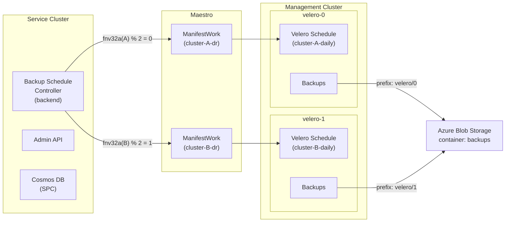
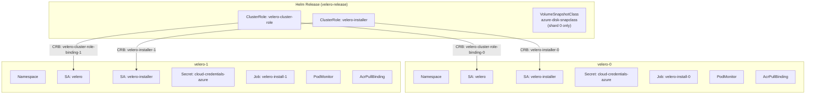

# Velero Sharding

## Problem

The current backup system deploys a single Velero instance per management cluster in the `velero` namespace. As the number of Hosted Control Planes (HCPs) per management cluster grows, this single instance becomes a bottleneck: Velero serializes backups within a single installation and a single BackupStorageLocation prefix. A single Velero instance handling hundreds of HCPs means backup windows grow linearly with cluster count.

## Goal

Deploy N Velero instances per management cluster, each in its own namespace, each responsible for a subset of HCPs. The shard count is configurable per environment. All shards share the same Azure Blob Storage account but write to separate path prefixes, enabling parallel backup execution across shards.

Target configuration: 2 shards for dev environments, 4 shards for INT/STG/PROD.

## Design Decisions

| Decision | Choice | Rationale |
|----------|--------|-----------|
| Shard assignment | `fnv32a(clusterID) % numShards` | Deterministic, stateless, even distribution, no Cosmos migration needed |
| Namespace naming | `velero-0`, `velero-1`, ... | Consistent naming across all shards |
| BSL prefix | `velero/0`, `velero/1`, ... | Shared storage account, separate blob paths per shard |
| Deployment model | Single Helm release in `velero-release` namespace, chart `{{ range }}` generates per-shard resources | One release to manage, no pipeline templating needed, clean lifecycle via Helm |
| Node-agent | Enabled per shard | Required for CSI snapshot data movement (`snapshotMoveData: true`). The cross-namespace scoping bug ([velero#6519](https://github.com/vmware-tanzu/velero/issues/6519)) was fixed in Velero 1.12 via [PR #6523](https://github.com/velero-io/velero/pull/6523). Our v1.16.1-OADP includes the fix. Additionally, all shards share the same MSI/credentials, making cross-wiring harmless even without the fix. **Known issue:** each shard deploys its own node-agent DaemonSet, so every node runs N node-agent pods (one per shard). This is redundant — a single node-agent per node is sufficient since the cross-namespace fix allows any node-agent to serve data-mover pods from any namespace. See [follow-up](#follow-up-work) |
| Identity model | Single shared MSI, N federated credentials | One managed identity with a federated credential per shard namespace. Simpler than per-shard MSIs |
| Config source | `mgmt.hcpBackups.veleroShardCount` | Single source of truth flowing to pipeline, backend, admin, and Bicep |

## Architecture



### Helm Release Model

A single Helm release is installed in the `velero-release` namespace. This namespace is an anchor only -- it holds no workloads. The chart uses `{{ range $i, $_ := until (int .Values.shardCount) }}` to generate all per-shard resources in namespaces `velero-0` through `velero-N`.



Helm applies Namespaces before other resource kinds, so ordering is safe. Install Jobs run as `post-install`/`post-upgrade` hooks after all non-hook resources (Namespaces, ServiceAccounts, Secrets, RBAC) are in place.

### Shard Assignment

Each HCP cluster is assigned to a shard using FNV-32a hash of the Cluster Service ID modulo the shard count. This is:

- **Deterministic** -- the same cluster always maps to the same shard (no state needed)
- **Stateless** -- no shard assignment stored in Cosmos; recomputed on every sync
- **Even** -- FNV-32a distributes well across small moduli

```go
func AssignShard(clusterID string, numShards int) int {
    if numShards <= 1 {
        return 0
    }
    h := fnv.New32a()
    h.Write([]byte(clusterID))
    return int(h.Sum32() % uint32(numShards))
}
```

### Data Flow

1. The backup controller computes `shardIndex = AssignShard(clusterID, shardCount)` and derives `veleroNamespace = fmt.Sprintf("velero-%d", shardIndex)`.
2. Velero Schedule objects in the ManifestWork target the computed namespace.
3. Maestro syncs the ManifestWork to the management cluster, creating the Schedule in the correct shard namespace.
4. Each Velero shard backs up its assigned clusters to `velero/<shardIndex>/` in the shared blob container.
5. Status feedback flows back through the ManifestWork unchanged (shard-agnostic).

## Changes Required

### Configuration

Add `veleroShardCount` to `config/config.yaml` under `mgmt.hcpBackups`:

```yaml
mgmt:
  hcpBackups:
    veleroShardCount: 2
    storageAccount: ...
```

Override per environment: `2` for dev/pers, `4` for INT/STG/PROD.

### Velero Helm Chart

#### `values.yaml`

| Change | Detail |
|--------|--------|
| Add `shardCount: 1` | Default to single shard for backward compatibility |
| Remove `configuration.deployNodeAgent` | Node-agent is not used |

#### New: `namespace.yaml`

Creates `Namespace velero-{{ $i }}` for each shard via `{{ range }}`.

#### Modified: `install-job.yaml`

Per-shard install Job wrapped in `{{ range }}`:

| Aspect | Current | Sharded |
|--------|---------|---------|
| Name | `velero-install` | `velero-install-{{ $i }}` |
| Namespace | `{{ .Release.Namespace }}` | `velero-{{ $i }}` |
| `--namespace` | `{{ .Release.Namespace }}` | `velero-{{ $i }}` |
| `--prefix` | `{{ .Values.configuration.backupPrefix }}` | `velero/{{ $i }}` |
| `--use-node-agent` | Present | Present |
| node-agent rollout check | Present | Present |
| SA | `velero-installer` in release NS | `velero-installer` in `velero-{{ $i }}` |

#### Modified: `velero-rbac.yaml`

| Resource | Current | Sharded |
|----------|---------|---------|
| ClusterRole | `velero-cluster-role` | Unchanged (created once, outside `{{ range }}`) |
| ClusterRoleBinding | `velero-cluster-role-binding` | `velero-cluster-role-binding-{{ $i }}` per shard, binds SA `velero` in `velero-{{ $i }}` |

#### Modified: `installer-rbac.yaml`

| Resource | Current | Sharded |
|----------|---------|---------|
| ServiceAccount | `velero-installer` in release NS | `velero-installer` in `velero-{{ $i }}` per shard |
| ClusterRole | `velero-installer` | Unchanged (created once, outside `{{ range }}`) |
| ClusterRoleBinding | `velero-installer` | `velero-installer-{{ $i }}` per shard, binds SA in `velero-{{ $i }}` |

**Why RBAC names must be unique per shard:** ClusterRoleBindings are cluster-scoped. With N shards, a shared binding name means the last `kubectl apply` overwrites the subject to point at only that shard's ServiceAccount. All other shards lose their RBAC. Unique names per shard give each its own binding.

#### Modified: `serviceaccount.yaml`

Per-shard SA `velero` in `velero-{{ $i }}`, same `clientId` annotation (single shared MSI).

#### Modified: `credentials-secret.yaml`

Per-shard Secret `cloud-credentials-azure` in `velero-{{ $i }}`, same `clientId`.

#### Modified: `kustomize-patch.yaml`

Per-shard ConfigMap `velero-kustomize-patch-{{ $i }}` in `velero-{{ $i }}`. Deployment and DaemonSet (node-agent) patches target `velero-{{ $i }}` namespace.

#### Modified: `acrpullbinding.yaml`

Per-shard `velero-pull-binding-{{ $i }}` in `velero-{{ $i }}`, referencing SA `velero` in that namespace.

#### Modified: `velero-podmonitor.yaml`

Per-shard PodMonitor in `velero-{{ $i }}`, watching that namespace.

#### Modified: `volumesnapshotclass.yaml`

Guarded with `{{- if eq $i 0 }}`. VolumeSnapshotClass is cluster-scoped -- created once by shard 0.

#### Modified: `node-agent-podmonitor.yaml`

Per-shard PodMonitor `node-agent-{{ $i }}` in `velero-{{ $i }}`, watching that namespace for node-agent pods.

**CRD note (acceptable for dev):** All shards' install jobs will apply the same Velero CRDs. This is idempotent via `kubectl apply` and works in practice, though concurrent applies may produce transient conflict errors that the install job retries. This is acceptable for dev; production should extract CRD installation into a separate pre-shard step.

### Velero Pipeline

The pipeline step changes minimally -- `releaseNamespace` changes and `shardCount` is passed as a value:

```yaml
- name: deploy-velero
  aksCluster: '{{ .mgmt.aks.name }}'
  action: Helm
  releaseName: 'velero'
  releaseNamespace: 'velero-release'
  chartDir: ./deploy
  valuesFile: ./deploy/values.yaml
  inputVariables:
    shardCount: '{{ .mgmt.hcpBackups.veleroShardCount }}'
    # ... existing inputs unchanged
```

No `{{ range }}` in the pipeline -- all sharding logic lives in the Helm chart.

### Bicep Infrastructure

The workload identity system assumed 1:1 mapping (one entry = one MSI = one fedcred). Velero sharding requires N:1 (N fedcreds on one MSI). The fix is in the shared modules:

| File | Change |
|------|--------|
| `mgmt-cluster.bicep` | Add `param veleroShardCount`, generate per-shard entries in `workloadIdentities` via loop. Deduplicate MSI names with `union()` when passing to `managed-identities.bicep` |
| `aks-cluster-base.bicep` | Deduplicate `uami` existing references with `union()`. Use entry `.key` (unique from `items()`) instead of `uamiName` in fedcred and puller-fedcred names. Use `indexOf` to find the correct MSI parent when entries share a `uamiName` |

Each shard namespace gets its own federated credential on the shared managed identity (same `clientId`, different namespace binding). Fedcred names use the workload identity map key (e.g. `velero_wi_0-westus3-fedcred`) for uniqueness.

### Go Code

#### New: `backend/pkg/controllers/backupcontroller/shard.go`

- `AssignShard(clusterID string, numShards int) int`
- `VeleroShardNamespace(shardIndex int) string` -- returns `"velero-N"`
- `VeleroBackupPrefix(shardIndex int) string` -- returns `"velero/N"`

#### Modified: `backend/pkg/controllers/backupcontroller/config.go`

Add `VeleroShardCount int` to `BackupConfig`. Default to 1 if unset.

#### Modified: `backend/pkg/controllers/backupcontroller/schedule.go`

`NewScheduledBackup` gains a `veleroNamespace string` parameter, replacing the hardcoded `"velero"` in `builder.ForSchedule(...)`.

#### Modified: `internal/recovery/backup.go`

`NewBackup` gains a `veleroNamespace string` parameter, replacing the hardcoded `"velero"` in `builder.ForBackup(...)`.

#### Modified: `backend/pkg/controllers/backupcontroller/backup_controller.go`

In `SyncOnce()`, compute shard assignment and pass the derived namespace:

```go
shardIndex := AssignShard(clusterID, c.backupConfig.VeleroShardCount)
veleroNS := VeleroShardNamespace(shardIndex)
// pass veleroNS to NewScheduledBackup and NewBackup calls
```

#### Modified: `admin/server/handlers/hcp/backups.go`

Extend `drContext` with `veleroNamespace string`. Compute during `resolveDRContext`. Replace hardcoded `"velero"` in `getBackup`, `listBackupsForCluster`, and `createBackupForCluster`.

Thread `veleroShardCount` from `NewAdminAPI` through the handler constructors.

#### Unchanged: `delete_orphaned_backup_manifestworks.go`

Operates at the Maestro ManifestWork level using labels and SPC references. Shard-agnostic.

## Re-sharding

When `veleroShardCount` changes (e.g., 1 to 4):

- Clusters are reassigned via `fnv32a(id) % newCount`.
- The backup controller patches ManifestWorks to target new shard namespaces within a few sync cycles (~5 min each).
- Old Velero Schedules in previous namespaces become orphaned on the management cluster.
- Backup data under old prefixes remains intact and accessible for restore.
- When scaling down (e.g., 4 to 2), `helm upgrade` removes namespaces `velero-2` and `velero-3` and all resources within them. Backup data in blob storage is unaffected.

## Follow-up Work

### Orphaned Schedule Cleanup

A cleanup mechanism for orphaned Velero Schedules (the current orphan cleanup handles ManifestWorks only). Until implemented, orphaned schedules expire via TTL.

### Deduplicate Node-Agent DaemonSets

Each shard deploys its own node-agent DaemonSet, resulting in `shardCount` node-agent pods per node. With 2 shards and 3 worker nodes, that's 6 node-agent pods when 3 would suffice. At 4 shards in prod, 4 identical node-agent pods run on every node.

This is redundant — since the cross-namespace fix (velero#6519/PR#6523) is included in our v1.16.1-OADP, a single node-agent can serve data-mover pods from any Velero namespace. All shards share the same MSI/credentials, so a single shared node-agent DaemonSet (deployed once, outside the shard `{{ range }}` loop) would be sufficient.

Options:
1. **Shared node-agent DaemonSet** — deploy one node-agent DaemonSet in a fixed namespace (e.g. `velero-0` or `velero-release`), remove `--use-node-agent` from per-shard install jobs. Requires validating that the node-agent correctly handles DataUpload CRs across namespaces.
2. **Velero upstream** — check if Velero supports a `--node-agent-namespace` flag or similar cross-namespace node-agent configuration.

## Testing

### Dev MVP (shardCount=2)

1. Deploy Velero with 2 shards. Verify both `velero-0` and `velero-1` namespaces exist with running Velero pods.
2. Verify unique ClusterRoleBindings: `velero-cluster-role-binding-0` and `velero-cluster-role-binding-1` both exist and reference the correct ServiceAccount.
3. Verify VolumeSnapshotClass `azure-disk-snapclass` is created once (by shard 0 only).
4. Verify BSLs: `velero-0` has prefix `velero/0`, `velero-1` has prefix `velero/1`.
5. Create an HCP backup and confirm the Schedule lands in the correct shard namespace based on `fnv32a(clusterID) % 2`.
6. Verify backup data appears under the correct prefix in blob storage.

### Full test matrix

- **Unit tests** for shard assignment: determinism, distribution, edge cases
- **Helm template tests**: unique ClusterRole names, correct prefixes per shard
- **Integration**: deploy with `shardCount=4`, verify schedules in correct namespaces
- **E2E**: existing tests pass with `shardCount=2`; new variant for multi-shard